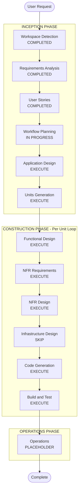

# Execution Plan
## 항공사 Revenue Management 가격관리 프로그램

---

## 1. 상세 분석 요약

### Change Impact Assessment
- **User-facing changes**: Yes — 대시보드, 운임관리, AI추천, 시뮬레이터, 보고서 전 기능 신규 구축
- **Structural changes**: Yes — React 프론트엔드 + FastAPI 백엔드 + AI/ML 서비스 + DB 다중 패키지 신규 설계
- **Data model changes**: Yes — Flight, Fare, BookingClass, PriceHistory, Simulation 등 신규 데이터 모델 설계 필요
- **API changes**: Yes — 프론트↔백엔드 REST API 전체 신규 설계
- **NFR impact**: Yes — 성능(3s 로딩/1s API), PBT(Hypothesis), 기본 인증(JWT)

### Risk Assessment
- **Risk Level**: Medium
- **Rollback Complexity**: Easy (Greenfield, Mock 데이터 기반)
- **Testing Complexity**: Moderate (PBT 전면 적용, 가격 계산 불변 속성 검증)

---

## 2. Workflow Visualization



### 텍스트 대안 (Text Alternative)

```
INCEPTION PHASE
  - Workspace Detection     : COMPLETED
  - Requirements Analysis   : COMPLETED
  - User Stories            : COMPLETED
  - Workflow Planning       : IN PROGRESS (현재)
  - Application Design      : EXECUTE
  - Units Generation        : EXECUTE

CONSTRUCTION PHASE (유닛별 반복)
  - Functional Design       : EXECUTE
  - NFR Requirements        : EXECUTE
  - NFR Design              : EXECUTE
  - Infrastructure Design   : SKIP
  - Code Generation         : EXECUTE (Always)
  - Build and Test          : EXECUTE (Always)

OPERATIONS PHASE
  - Operations              : PLACEHOLDER
```

---

## 3. 단계별 실행 계획

### INCEPTION PHASE

| 단계 | 결정 | 근거 |
|---|---|---|
| Workspace Detection | COMPLETED | ✅ |
| Requirements Analysis | COMPLETED | ✅ |
| User Stories | COMPLETED | ✅ |
| Workflow Planning | IN PROGRESS | 현재 단계 |
| **Application Design** | **EXECUTE** | 신규 컴포넌트(FastAPI 서비스, AI/ML 엔진, DB 레이어) 필요. 컴포넌트 메서드 및 비즈니스 규칙(BR-01~09) 설계 필요 |
| **Units Generation** | **EXECUTE** | 3개 패키지(Frontend/Backend/AI-ML)로 분해 필요. 복잡한 의존성 및 인터페이스 정의 필요 |

### CONSTRUCTION PHASE (유닛별 반복)

| 단계 | 결정 | 근거 |
|---|---|---|
| **Functional Design** | **EXECUTE** | 신규 데이터 모델(Flight, Fare, BookingClass, PriceHistory 등) 및 복잡한 가격 계산 로직 설계 필요 |
| **NFR Requirements** | **EXECUTE** | 성능(NFR-01), PBT(NFR-05: Hypothesis 전면 적용), JWT 인증(NFR-03) 요구사항 존재 |
| **NFR Design** | **EXECUTE** | NFR Requirements 실행되므로 패턴 통합 설계 필요 |
| **Infrastructure Design** | **SKIP** | 해커톤 데모 환경. AWS 배포는 단순 EC2/ECS 수준으로 별도 인프라 설계 불필요. Code Generation 단계에서 Dockerfile/배포 설정 포함으로 충분 |
| **Code Generation** | **EXECUTE** | Always — 구현 계획 및 코드 생성 (프론트엔드 프로토타입 기반 확장 포함) |
| **Build and Test** | **EXECUTE** | Always — 빌드, 테스트, PBT 실행 가이드 필요 |

---

## 4. 예상 유닛 (Units Preview)

Units Generation 단계에서 확정되지만, 현재 분석 기준 예상 구성:

| Unit | 패키지 | 주요 내용 |
|---|---|---|
| Unit 1 | Frontend (React/TypeScript) | 6개 탭 UI, 대시보드 재설계 기반 확장, API 연동 |
| Unit 2 | Backend API (FastAPI/Python) | REST API 엔드포인트, 가격 계산 서비스, 하이브리드 승인 로직 |
| Unit 3 | AI/ML Engine (Python) | 수요 예측, 가격 추천, 시뮬레이션, Hypothesis PBT 테스트 |

---

## 5. 성공 기준

- **Primary Goal**: 해커톤 데모 수준의 완전한 동작 프로토타입 구축
- **Key Deliverables**:
  - 실시간 대시보드 (basic_guide.html 기준 레이아웃)
  - AI 추천 + 하이브리드 자동 승인 흐름
  - What-if 시뮬레이터
  - 보고서 자동 생성 (PDF/docx)
  - PBT 기반 가격 계산 로직 검증
- **Quality Gates**:
  - 가격 불변 속성 PBT 통과 (BR-01~09)
  - API 응답 1초 이내
  - 대시보드 초기 로딩 3초 이내
